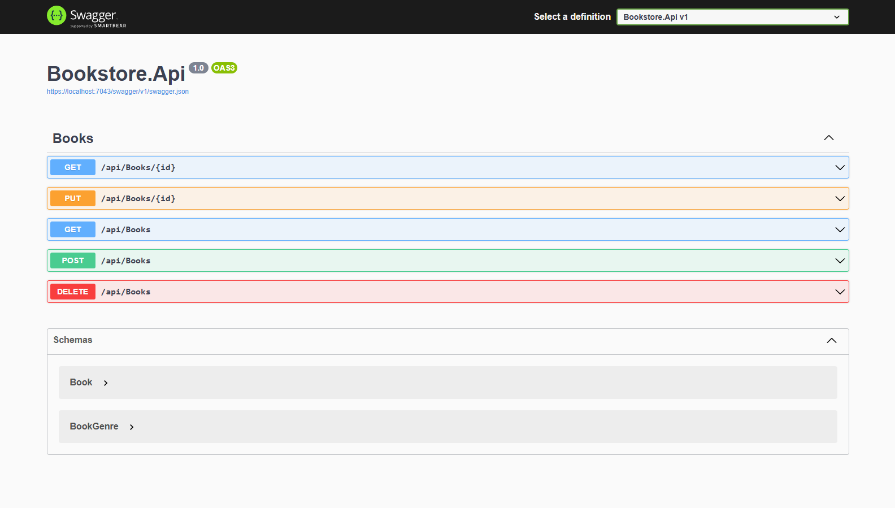

# net8-bookstore-api

## A simple CRUD implementation with an ASP.NET Core Web Api about a bookstore



## Prerequisites
- [.NET8]([https://nodejs.org/en/](https://dotnet.microsoft.com/en-us/download/dotnet/8.0))

## Installation

1. Clone the repo:
    ```bash
    git clone https://github.com/LucasFdCosta/net8-bookstore-api.git
    ```
2. Navigate into the project directory:
    ```bash
    cd net8-bookstore-api
    ```
3. Run project:
    ```bash
    dotnet run --project Bookstore.Api
    ```
    OR
   If Visual Studio is installed, open the project solution "net8-bookstore-api.sln" then press "F5" to debug

## Usage

To access the endpoints, follow the instructions above. Then open your web browser and go to the [Swagger Page](https://localhost:7043/swagger/index.html). Here the endpoints will be displayed

## Features

- Listing books
- Get book by id
- Add new book
- Edit existing book
- Remove existing book

## Concepts
- HTTP Requests
- ASP.NET Core Web Api Controllers and endpoints
- CRUD
